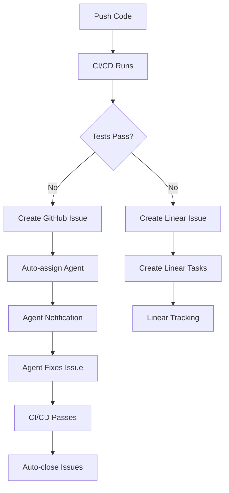

# 🚀 Guía Completa de Configuración del Sistema Automatizado

## 📋 Resumen del Sistema

Este sistema automatiza la gestión de errores CI/CD integrando **GitHub Actions** con **Linear** para:
- ✅ Detectar fallos automáticamente
- 🎯 Asignar agentes especializados
- 📊 Crear tareas estructuradas en Linear
- 🔄 Sincronizar estado entre plataformas
- 📈 Generar métricas de rendimiento

---

## 🔧 PASO 1: Configuración de Linear

### 1.1 Obtener API Key
```bash
# 1. Ve a Linear → Settings → API → Personal API Keys
# 2. Click "Create new key"
# 3. Nombre: "GitHub CI/CD Integration"
# 4. Permisos: Read/Write Issues, Teams
# 5. Copiar el token generado (lin_api_...)
```

### 1.2 Configurar Team ID
```bash
# 1. Ve a tu team en Linear
# 2. Copia el ID de la URL
# Ejemplo: linear.app/team/ABC123/issues → Team ID = ABC123
```

### 1.3 Crear Webhook (Opcional)
```bash
# 1. Linear → Settings → API → Webhooks
# 2. URL: https://api.github.com/repos/TU-USUARIO/TU-REPO/dispatches
# 3. Events: Issue created, Issue updated, Issue completed
# 4. Copiar Webhook ID generado
```

---

## 🔐 PASO 2: Configuración de GitHub Secrets

### 2.1 Acceder a Secrets
```bash
# Ve a: GitHub Repository → Settings → Secrets and Variables → Actions
```

### 2.2 Añadir Secrets Requeridos

#### **Linear Integration**
```bash
LINEAR_API_KEY=lin_api_xxxxxxxxxxxxxxxxx
LINEAR_TEAM_ID=ABC123
LINEAR_WEBHOOK_ID=webhook_xxxxxxxxxxxxxxxxx  # Opcional
```

#### **Agent Assignments** (Usernames de GitHub)
```bash
LINT_AGENT_USERNAME=usuario_para_lint
TEST_AGENT_USERNAME=usuario_para_tests
BUILD_AGENT_USERNAME=usuario_para_build
DEVOPS_AGENT_USERNAME=usuario_para_cicd
DEPLOY_AGENT_USERNAME=usuario_para_deploy
SECURITY_AGENT_USERNAME=usuario_para_security
```

#### **NPM Publishing** (Opcional)
```bash
NPM_TOKEN=npm_xxxxxxxxxxxxxxxxxxx
```

---

## ⚙️ PASO 3: Verificar Workflows

### 3.1 Workflows Incluidos
- ✅ `.github/workflows/ci-cd.yml` - Pipeline principal
- ✅ `.github/workflows/linear-integration.yml` - Integración Linear

### 3.2 Verificar Permisos
```yaml
# Los workflows ya incluyen estos permisos:
permissions:
  contents: write
  issues: write
  pull-requests: write
  checks: write
  actions: write
```

---

## 🚀 PASO 4: Activación del Sistema

### 4.1 Comando de Activación
```bash
# 1. Asegúrate de que todos los secrets están configurados
# 2. Ejecuta estos comandos:

git add .
git commit -m "feat: activate automated error management system"
git push
```

### 4.2 Probar el Sistema
```bash
# Crear un error intencional para probar:
echo "// Test error - invalid syntax" >> src/index.ts
git add .
git commit -m "test: trigger ci failure for testing"
git push

# Esto debería:
# ✅ Fallar el CI/CD
# ✅ Crear issue en GitHub
# ✅ Crear issue en Linear
# ✅ Asignar agente automáticamente
```

---

## 🤖 PASO 5: Funcionamiento del Sistema

### 5.1 Flujo Automático


### 5.2 Tipos de Errores y Asignaciones
| Error Type | Agent | Priority | Auto-Tasks |
|------------|-------|----------|------------|
| **Lint** | LINT_AGENT | Low | Style fixes, rule updates |
| **Test** | TEST_AGENT | Medium | Debug tests, fix logic |
| **Build** | BUILD_AGENT | Medium | Fix compilation, deps |
| **CI/CD** | DEVOPS_AGENT | High | Fix pipeline, permissions |
| **Deploy** | DEPLOY_AGENT | High | Fix deployment, rollback |
| **Security** | SECURITY_AGENT | Critical | Security patches, audit |

---

## 📊 PASO 6: Monitoreo y Comandos

### 6.1 Comandos de Agente
Los agentes pueden usar estos comandos en comentarios de issues:

```bash
/assign @username     # Reasignar issue
/priority high        # Cambiar prioridad
/label bug           # Añadir etiqueta
/close               # Cerrar issue
/linear-sync         # Sincronizar con Linear
/rerun-ci           # Re-ejecutar CI/CD
```

### 6.2 Métricas Disponibles
- 📈 **Issues por tipo**: lint, test, build, deploy
- ⏱️ **Tiempo de resolución**: promedio por agente
- 📊 **Frecuencia de errores**: tendencias semanales
- 🏆 **Agentes más activos**: ranking de resoluciones

---

## 🔄 PASO 7: Proceso de Escalación

### Nivel 1: Automático (0-30min)
- ✅ Detección automática
- ✅ Asignación de agente
- ✅ Creación de tasks en Linear

### Nivel 2: Humano (30min-2h)
- 🔔 Notificación a agente asignado
- 👤 Intervención manual requerida
- 📋 Seguimiento activo

### Nivel 3: Escalación (2h+)
- 🚨 Notificación a team lead
- 🔄 Reasignación automática
- ⚡ Prioridad crítica

---

## ✅ PASO 8: Verificación Final

### 8.1 Checklist de Configuración
- [ ] Linear API Key configurado
- [ ] Team ID obtenido
- [ ] Todos los secrets de GitHub añadidos
- [ ] Usernames de agentes válidos
- [ ] Workflows activados
- [ ] Test de error realizado

### 8.2 Comandos de Verificación
```bash
# Verificar que los workflows están activos:
gh workflow list

# Verificar último run:
gh run list --limit 5

# Ver logs del último run:
gh run view --log
```

---

## 🆘 Troubleshooting

### Problemas Comunes

#### 1. Linear API Error
```bash
# Verificar API Key:
curl -H "Authorization: Bearer YOUR_LINEAR_API_KEY" \
     https://api.linear.app/graphql \
     -d '{"query":"{ viewer { id name } }"}'
```

#### 2. GitHub Secrets No Funcionan
```bash
# Verificar que los secrets existen:
# GitHub → Settings → Secrets → Actions
# Asegúrate de que los nombres coinciden exactamente
```

#### 3. Agentes No Se Asignan
```bash
# Verificar que los usernames existen:
# Los usernames deben ser válidos en GitHub
# Deben tener acceso al repositorio
```

#### 4. Workflows No Se Ejecutan
```bash
# Verificar permisos del repositorio:
# Settings → Actions → General → Workflow permissions
# Debe estar en "Read and write permissions"
```

---

## 🎯 Próximos Pasos

1. **Configurar notificaciones** (Slack/Discord)
2. **Personalizar reglas de asignación**
3. **Añadir métricas avanzadas**
4. **Integrar con más herramientas**
5. **Configurar alertas por email**

---

**Estado**: 🟢 Sistema listo para activar
**Tiempo de configuración**: ~15 minutos
**Mantenimiento**: Automático

¿Necesitas ayuda con algún paso específico? ¡Pregúntame!