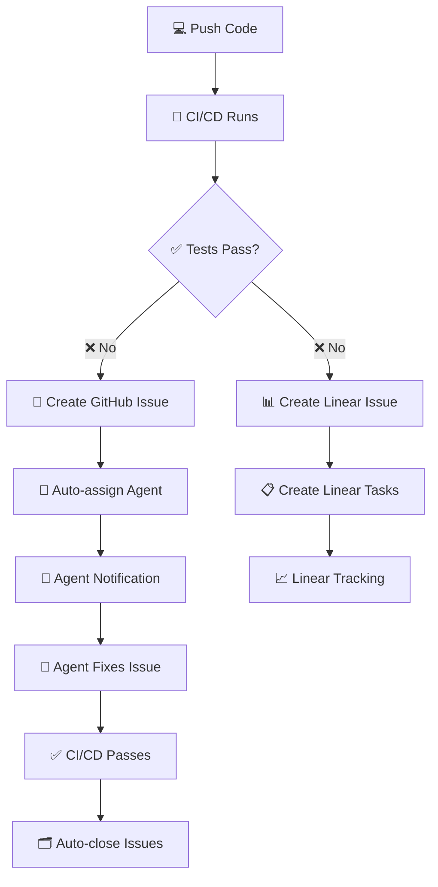

# 🤖 Sistema de Automatización de Gestión de Errores

## 🎯 Descripción

Sistema automatizado que integra **GitHub Actions** con **Linear** para gestionar errores de CI/CD de forma inteligente:

- ✅ **Detección automática** de fallos en CI/CD
- 🎯 **Asignación inteligente** de agentes especializados
- 📊 **Creación automática** de issues y tareas
- 🔄 **Sincronización bidireccional** GitHub ↔ Linear
- 📈 **Métricas y seguimiento** automatizado

---

## 🚀 Inicio Rápido

### Configuración Automática (Recomendado)
```bash
# Ejecutar script de configuración interactivo
./setup-automation-system.sh
```

### Configuración Manual
1. 📖 Lee la [Guía Completa](./CONFIGURACION-AUTOMATIZADA-GUIA.md)
2. 🔧 Configura secrets en GitHub
3. ⚙️ Configura Linear API
4. 🚀 Activa el sistema

### Verificación
```bash
# Verificar que todo funciona correctamente
./verify-automation-system.sh
```

---

## 📋 Archivos del Sistema

| Archivo | Descripción | Uso |
|---------|-------------|-----|
| [`CONFIGURACION-AUTOMATIZADA-GUIA.md`](./CONFIGURACION-AUTOMATIZADA-GUIA.md) | 📖 Guía completa paso a paso | Configuración manual detallada |
| [`setup-automation-system.sh`](./setup-automation-system.sh) | 🔧 Script de configuración automática | Configuración interactiva |
| [`verify-automation-system.sh`](./verify-automation-system.sh) | 🔍 Script de verificación | Comprobar estado del sistema |
| [`SETUP-AUTOMATION.md`](./SETUP-AUTOMATION.md) | 📋 Documentación técnica original | Referencia técnica |
| [`.github/workflows/ci-cd.yml`](./.github/workflows/ci-cd.yml) | ⚙️ Pipeline principal CI/CD | Workflow principal |
| [`.github/workflows/linear-integration.yml`](./.github/workflows/linear-integration.yml) | 🔗 Integración con Linear | Sincronización automática |

---

## 🔧 Configuración Requerida

### GitHub Secrets
```bash
# Linear Integration
LINEAR_API_KEY=lin_api_xxxxxxxxx
LINEAR_TEAM_ID=team_id_here
LINEAR_WEBHOOK_ID=webhook_id_here  # Opcional

# Agent Assignments
LINT_AGENT_USERNAME=username_lint
TEST_AGENT_USERNAME=username_test
BUILD_AGENT_USERNAME=username_build
DEVOPS_AGENT_USERNAME=username_devops
DEPLOY_AGENT_USERNAME=username_deploy
SECURITY_AGENT_USERNAME=username_security

# NPM Publishing (Opcional)
NPM_TOKEN=npm_token_here
```

### Linear Setup
1. **API Key**: `Settings → API → Personal API Keys`
2. **Team ID**: Extraer de URL del team
3. **Webhook**: `Settings → API → Webhooks` (opcional)

---

## 🤖 Funcionamiento del Sistema

### Flujo Automático


### Tipos de Errores y Agentes
| 🏷️ Tipo Error | 👤 Agente | ⚡ Prioridad | 🔧 Tareas Automáticas |
|---------------|----------|-------------|----------------------|
| **Lint** | LINT_AGENT | 🟢 Low | Fix style, update rules |
| **Test** | TEST_AGENT | 🟡 Medium | Debug tests, fix logic |
| **Build** | BUILD_AGENT | 🟡 Medium | Fix compilation, deps |
| **CI/CD** | DEVOPS_AGENT | 🟠 High | Fix pipeline, permissions |
| **Deploy** | DEPLOY_AGENT | 🟠 High | Fix deployment, rollback |
| **Security** | SECURITY_AGENT | 🔴 Critical | Security patches, audit |

---

## 📊 Comandos de Agente

Los agentes pueden usar estos comandos en comentarios de issues:

```bash
/assign @username     # Reasignar issue
/priority high        # Cambiar prioridad
/label bug           # Añadir etiqueta
/close               # Cerrar issue
/linear-sync         # Sincronizar con Linear
/rerun-ci           # Re-ejecutar CI/CD
```

---

## 🔄 Proceso de Escalación

### 🟢 Nivel 1: Automático (0-30min)
- ✅ Detección automática
- ✅ Asignación de agente
- ✅ Creación de tasks en Linear

### 🟡 Nivel 2: Humano (30min-2h)
- 🔔 Notificación a agente asignado
- 👤 Intervención manual requerida
- 📋 Seguimiento activo

### 🔴 Nivel 3: Escalación (2h+)
- 🚨 Notificación a team lead
- 🔄 Reasignación automática
- ⚡ Prioridad crítica

---

## 📈 Métricas y Monitoreo

### Dashboard Linear
- 📊 **Issues por tipo**: lint, test, build, deploy
- ⏱️ **Tiempo resolución**: promedio por agente
- 📈 **Frecuencia errores**: tendencias semanales
- 🏆 **Agentes más activos**: ranking de resoluciones

### Alertas Configuradas
- 💬 **Slack/Discord**: Para errores críticos
- 📧 **Email**: Para issues sin asignar > 1 hora
- 📊 **Linear**: Para todas las actualizaciones

---

## 🛠️ Comandos Útiles

### Configuración
```bash
# Configuración automática
./setup-automation-system.sh

# Verificación del sistema
./verify-automation-system.sh

# Activar sistema manualmente
git add .
git commit -m "feat: activate automated error management"
git push
```

### Verificación con GitHub CLI
```bash
# Ver workflows
gh workflow list

# Ver últimos runs
gh run list --limit 5

# Ver logs del último run
gh run view --log

# Ver secrets configurados
gh secret list
```

### Prueba del Sistema
```bash
# Crear error intencional
echo "// Test error" >> src/index.ts
git add . && git commit -m "test: trigger ci failure" && git push

# Revertir error de prueba
git revert HEAD --no-edit && git push
```

---

## 🆘 Troubleshooting

### Problemas Comunes

#### ❌ Linear API Error
```bash
# Verificar API Key
curl -H "Authorization: Bearer YOUR_API_KEY" \
     https://api.linear.app/graphql \
     -d '{"query":"{ viewer { id name } }"}'
```

#### ❌ Secrets No Funcionan
- Verificar nombres exactos en GitHub
- Confirmar permisos del repositorio
- Revisar que los usernames existen

#### ❌ Workflows No Se Ejecutan
- `Settings → Actions → General → Workflow permissions`
- Debe estar en "Read and write permissions"

#### ❌ Agentes No Se Asignan
- Verificar usernames válidos en GitHub
- Confirmar acceso al repositorio
- Revisar logs de GitHub Actions

---

## 📚 Documentación Adicional

- 📖 [Guía Completa de Configuración](./CONFIGURACION-AUTOMATIZADA-GUIA.md)
- 📋 [Documentación Técnica Original](./SETUP-AUTOMATION.md)
- 🔗 [GitHub Actions Documentation](https://docs.github.com/en/actions)
- 🔗 [Linear API Documentation](https://developers.linear.app/docs)

---

## 🎯 Estado del Sistema

- ✅ **Workflows**: Configurados y activos
- ✅ **Scripts**: Listos para usar
- ⚠️ **Secrets**: Requieren configuración
- ⚠️ **Linear**: Requiere configuración
- 🟢 **Estado**: Listo para activar

---

## 🚀 Próximos Pasos

1. **Ejecutar configuración**: `./setup-automation-system.sh`
2. **Verificar sistema**: `./verify-automation-system.sh`
3. **Probar con error intencional**
4. **Configurar notificaciones adicionales**
5. **Personalizar reglas de asignación**

---

**¿Necesitas ayuda?** Consulta la [Guía Completa](./CONFIGURACION-AUTOMATIZADA-GUIA.md) o ejecuta los scripts de configuración automática.