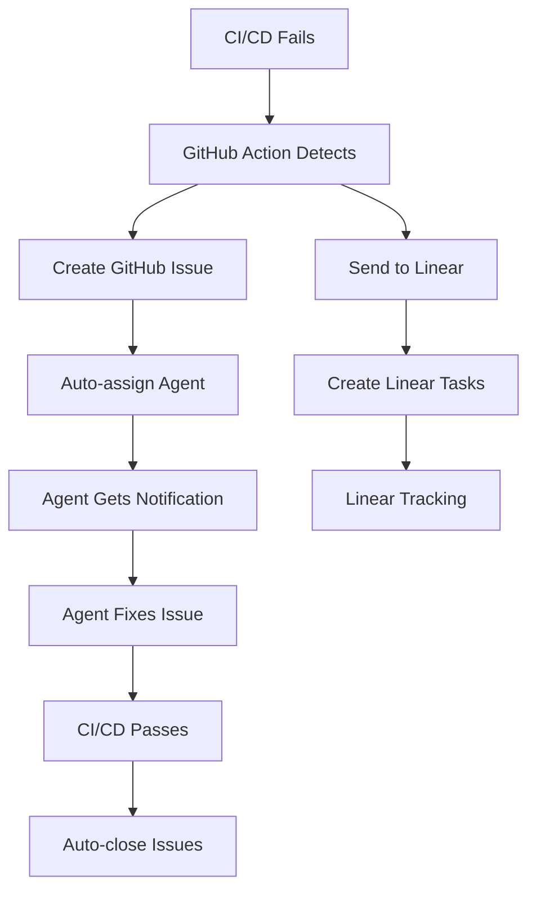

# 🔧 Configuración de Automatización Linear + GitHub

## 📋 Secrets Requeridos en GitHub

Ve a `GitHub Repository → Settings → Secrets and Variables → Actions` y añade:

### **Linear Integration**
```bash
LINEAR_API_KEY=lin_api_xxxxxxxxxxxxxxxxx
LINEAR_WEBHOOK_ID=webhook_xxxxxxxxxxxxxxxxx
LINEAR_TEAM_ID=team_xxxxxxxxxxxxxxxxx
```

### **Agent Assignments**
```bash
LINT_AGENT_USERNAME=github_username_for_lint_issues
TEST_AGENT_USERNAME=github_username_for_test_issues  
BUILD_AGENT_USERNAME=github_username_for_build_issues
DEVOPS_AGENT_USERNAME=github_username_for_cicd_issues
DEPLOY_AGENT_USERNAME=github_username_for_deploy_issues
SECURITY_AGENT_USERNAME=github_username_for_security_issues
```

### **NPM Publishing**
```bash
NPM_TOKEN=npm_xxxxxxxxxxxxxxxxxxx
```

## 🎯 Configuración Linear

### **1. Obtener API Key**
```bash
# En Linear
Settings → API → Personal API Keys → Create new key
# Copiar el token generado
```

### **2. Crear Webhook**
```bash
# En Linear  
Settings → API → Webhooks → Create webhook
URL: https://api.github.com/repos/tu-usuario/tu-repo/dispatches
Events: Issue created, Issue updated, Issue completed
```

### **3. Configurar Team ID**
```bash
# En Linear, ir al team y copiar ID de la URL
# Ejemplo: linear.app/team/abc123/issues → abc123
```

## 🤖 Agentes Automáticos Configurados

### **Reglas de Asignación**
| Tipo Error | Agente Asignado | Prioridad | Tareas Automáticas |
|-------------|-----------------|-----------|-------------------|
| **Lint** | LINT_AGENT | Low | Fix style, update rules |
| **Test** | TEST_AGENT | Medium | Debug tests, fix logic |
| **Build** | BUILD_AGENT | Medium | Fix compilation, dependencies |
| **CI/CD** | DEVOPS_AGENT | High | Fix pipeline, permissions |
| **Deploy** | DEPLOY_AGENT | High | Fix deployment, rollback |
| **Security** | SECURITY_AGENT | Critical | Security patches, audit |

### **Flujo Automatizado**


## 🚀 Comandos de Activación

### **Activar Sistema Completo**
```bash
# 1. Configurar secrets en GitHub
# 2. Push este código para activar workflows
git add .
git commit -m "feat: activate automated error management system"
git push

# 3. Probar con error intencional
echo "// Test error" >> src/index.ts
git add . && git commit -m "test: trigger ci failure" && git push
```

### **Comandos de Agente**
Los agentes pueden usar estos comandos en comentarios de issues:

```bash
/assign @username     # Reasignar issue
/priority high        # Cambiar prioridad  
/label bug           # Añadir etiqueta
/close               # Cerrar issue
/linear-sync         # Sincronizar con Linear
/rerun-ci           # Re-ejecutar CI/CD
```

## 📊 Monitoreo y Métricas

### **Dashboard Linear**
- **Issues por tipo**: lint, test, build, deploy
- **Tiempo resolución**: promedio por agente
- **Frecuencia errores**: tendencias semanales
- **Agentes más activos**: ranking de resoluciones

### **Alertas Configuradas**
- **Slack/Discord**: Para errores críticos
- **Email**: Para issues sin asignar > 1 hora
- **Linear**: Para todas las actualizaciones

## 🔄 Proceso de Escalación

### **Nivel 1: Automático (0-30min)**
- Detección automática
- Asignación de agente
- Creación de tasks en Linear

### **Nivel 2: Humano (30min-2h)**
- Notificación a agente asignado
- Intervención manual requerida
- Seguimiento activo

### **Nivel 3: Escalación (2h+)**
- Notificación a team lead
- Reasignación automática
- Prioridad crítica

---

**Estado**: ✅ Configurado y listo para activar
**Próximo paso**: Configurar secrets en GitHub y hacer push para activar